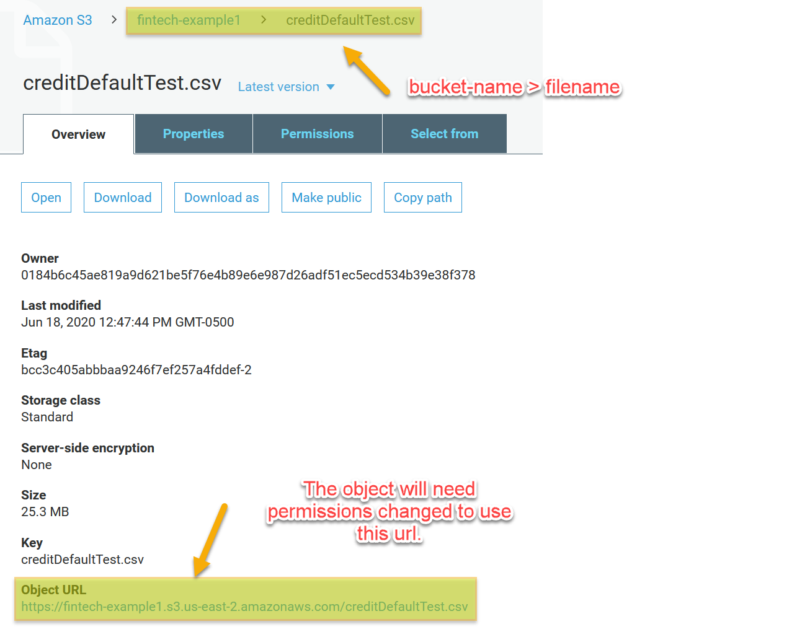
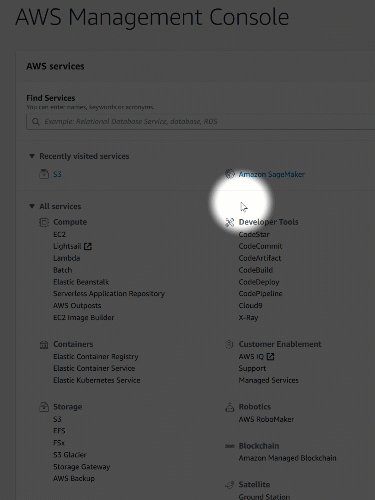
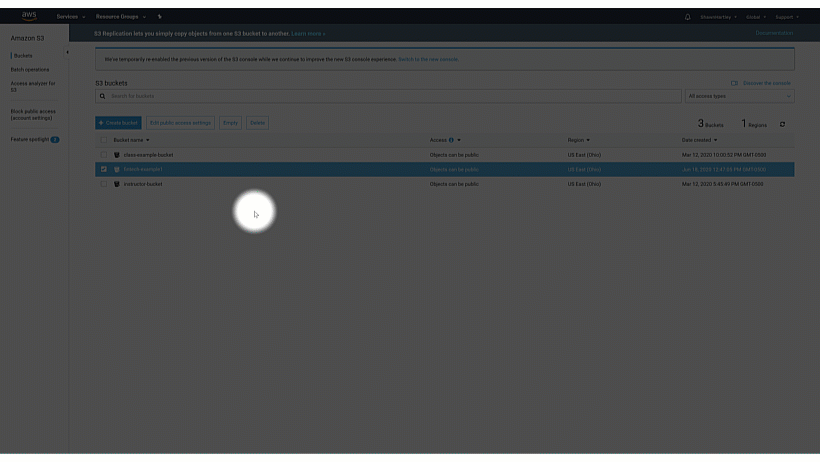
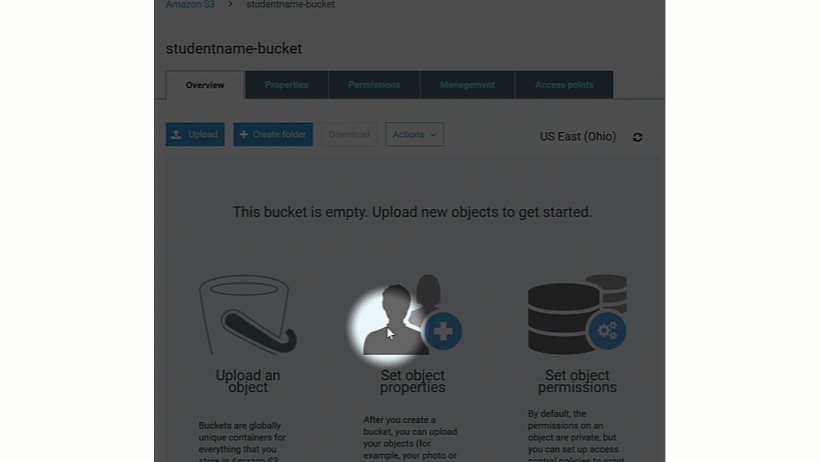
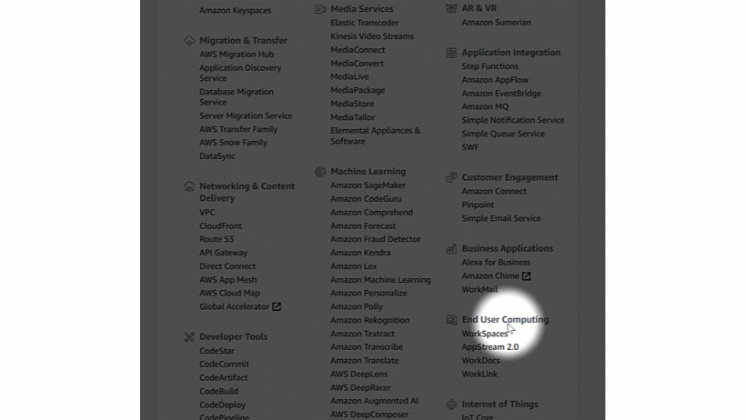
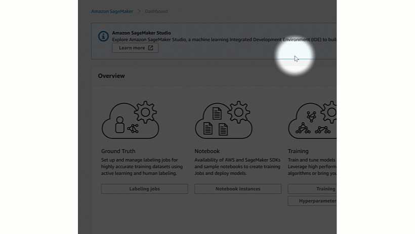
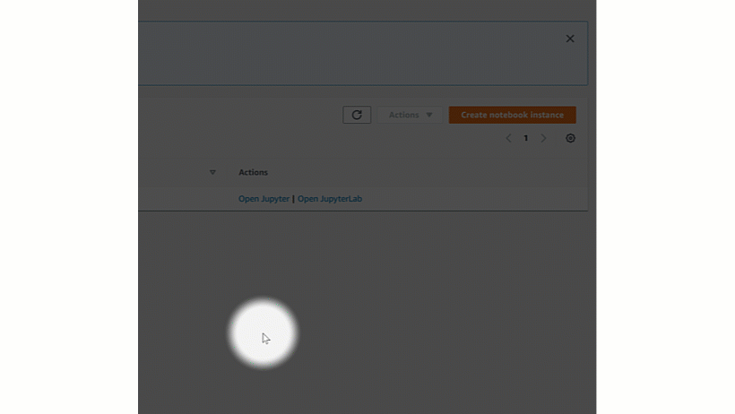
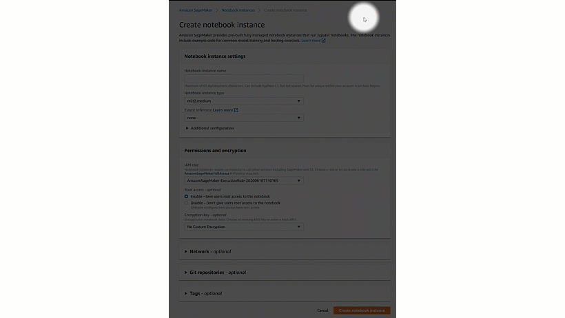
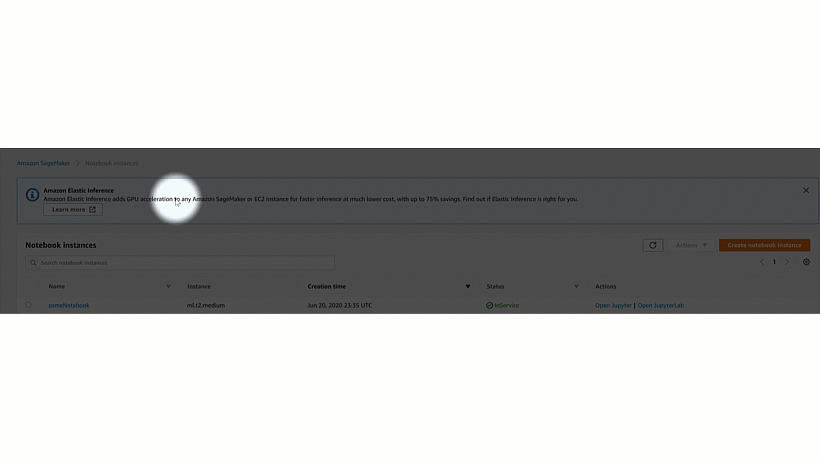
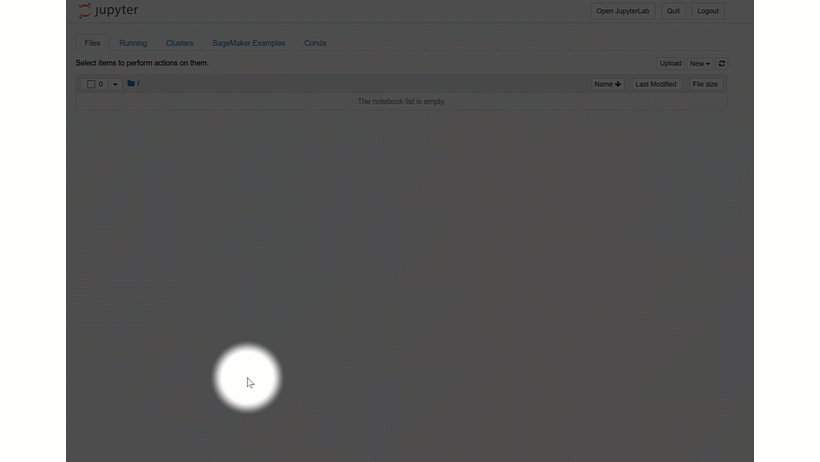

# 1.1 Lesson Plan: Predicting Credit Defaults with Amazon SageMaker

## Overview

Today's Class will train a Random Forest on data provided by [Home Credit](http://www.homecredit.net/ "Home Credit") to determine if a borrower is likely to default on a loan. The exploratory data analysis and model training will be conducted in a Jupyter Notebook on [Amazon SageMaker](https://aws.amazon.com/sagemaker/ "Amazon SageMaker provides a cloud service for machine learning."). The module files can be found at [this](https://github.com/thegrapesofwrath/finTechSageMaker "Module Github Repository") github repository. 

### Learning Objectives

At the end of the session, learners will be able to:
 
* Upload dataSets to an Amazon S3 bucket

* Retrieve data from a S3 bucket into a Jupyter notebook on SageMaker

* Understand how an exploratory data analysis is beneficial to train a model

* Understand how imputation is used to estimate missing values

* Understand how to create a random forest model

### Instructor Notes
Students will be expected to clone the data from the class repository and follow along to upload the files into their own [S3](https://aws.amazon.com/s3/ "Amazon file storage service") bucket. Once a notebook has been created proceed to introduce the topics on exploratory data analysis using the [slides](Slides/Slides.pptx "This week's slideshow."). 

Demonstrate an example exploratory analysis using the [mtcars](Activities/mtcars/mtcars.csv "mtcars Dataset") dataset. Split students into breakout rooms where they will try an exploratory analysis on the [creditDefaultTrain](Activities/creditDefaultData/creditDefaultTrain.csv "The credit default training data.") dataset. Upon returning from the breakout rooms have students share their findings. Proceed to finish the class by training the random forest model on creditDefaultTrain and then answer any questions. After class, students can test their model on the [creditDefaultTest](Activities/creditDefaultData/creditDefaultTest.csv) dataset and think of ways they can improve their accuracy.


##### Module Student Dependencies
* AWS account
* github account
* python proficiency
  

##### Potential Student Environment Issues
* Students maybe confused in their scripts between using the object URL and using an `s3://` url with the bucket name. If they try to use the object URL the file will not be accessible by SageMaker until the security settings are changed to make it public. Best practice would be to use the `s3://` url and bucket name as the file does not have to be made public. 

>**Tip**: If time permits and a student is having environment difficulties you may ask them to share their screen while you help them resolve it. Other students will benefit who are having the same issue.



`s3://` urls are thus created:
``` python
s3URL = "s3://fintech-example1/creditDefaultTest.csv" #s3://bucket-name/fileName
```

##### Git LFS
If a repository needs to be configured for large file storage after it has been created it maybe done so in the following way:
``` bash
git lfs install
git lfs track "*.csv" #type of file to track
git add .gitattributes

git add .
git commit -m "Added lfs"
git push origin master
```

##### Additional Reading
* [An Introduction to Statistical Learning](AdditionalReading/ISLRSeventhPrinting.pdf "This is a good reference and place to review some concepts for advanced students.") - Examples are in R and the theory is explained concisely.
* [Pearson's Correlation Coefficient](AdditionalReading/pearsons.pdf)
- - -

### 0. Class Do: Interview Question Warm-Up
##### (5 mins before class - first 2 mins of class) 

Open the [slides](Slides/Slides.pptx "This week's slideshow.") for today's class and begin the weekly presentation with the first slide. 

>**This week's question:** What are some advantages and disadvantages for using a cloud service to train machine learning models?

Allow the question to be on the screen 5 mins prior to the start of class as students join the session. Ask the class to answer the question as they complete the pre-lecture temperature check.

**Possible answers to this week's question:**

**Advantages**
* Maybe cheaper than setting up hardware at the organization.
* Quicker to set up and use
* Easy to scale if more resources are needed

**Disadvantages**
* Businesses may not allow external services to access sensitive data
* New authentication methods could be difficult to integrate into an enterprise's existing user authentication system.

---

### 0. Instructor Do: Temperature Check 
##### (5 mins before class - first 2 mins of class)
Using the [Zoom Polling](https://support.zoom.us/hc/en-us/articles/213756303-Polling-for-Meetings  "How to setup a zoom poll.") feature launch a poll for the class to identify where the class as a group is comfortable with the material. Do this while people are joining and during this time the TA may take attendance. 

**Poll Text:**

*Select all of the topics that you feel prepared to apply outside of the class from this week's lesson:*

* Accessing data from an Amazon S3 bucket : **A**
* Creating notebooks in SageMaker : **A**
* [Pearson's correlation coefficient](https://en.wikipedia.org/wiki/Pearson_correlation_coefficient "A statistic that measures linear correlation between two variables X and Y")  : **B**
* [Label Encoding](https://scikit-learn.org/stable/modules/generated/sklearn.preprocessing.LabelEncoder.html "Scikit LabelEncoder")  : **B**
* [One-hot Encoding](https://pandas.pydata.org/pandas-docs/stable/reference/api/pandas.get_dummies.html "Pandas get_dummies")  : **B**
* [Pandas dtypes](https://pandas.pydata.org/pandas-docs/stable/reference/api/pandas.DataFrame.dtypes.html "dtypes")  : **B**
* [Imputation](https://en.wikipedia.org/wiki/Imputation_(statistics) "Replacing missing data with substituted values")  : **C**
* [Random Forest](https://towardsdatascience.com/understanding-random-forest-58381e0602d2 "Random Forest Article")  : **C**

---

## A. S3 data upload and SageMaker notebook creation
### Everyone Do: Connect S3 and SageMaker
##### (20 minutes)

Everyone one must have an account created. Students will need to create two buckets, one for the `mtcars` dataset and one for the `creditDefault` dataset. They will then create one sageMaker notebook instance for their notebooks. Amazon has a limit of two notebook sessions per free account. Everyone will verify that it is set up correctly by pulling the `mtcars` dataset from the S3 bucket into their notebook.

>**Tip**: The `creditDefault` dataset is larger than the `mtcars` dataset. Students may have a slower internet speed so uploading at the beginning of class may save some time.

### Create a S3 bucket


Navigate to the [aws console](https://aws.amazon.com/console/) and click on the link for S3. 


Click on the create bucket button and give the bucket an Amazon approved name.
>**Note**: The bucket name may only contain lowercase letters and hyphens.



Choose the dataset and upload it to its appropriate bucket.


### Create a SageMaker notebook instance

Return to the aws console page and select the SageMaker link.

Once on the SageMaker landing page select the notebook instances link.

Create a new notebook instance.

Give the notebook instance a name and create it with the default options.


Wait for the notebook status to change from Pending to InService and open the new notebook instance.


Create a new Jupyter notebook and choose `conda_python3` for the environment.



Rename the newly created notebook to mtcarsAnalysis.

Verify that you can import the csv file in the S3 bucket into the Jupyter notebook using the following code:
``` python
# import libraries
from sagemaker import get_execution_role                            
import pandas as pd     

role = get_execution_role()     #Gets the current SageMaker instance execution role
awsBucketName = ''              #populate with the bucket name you created
fileName = 'mtcars.csv'
bucketPath = f"s3://{awsBucketName}/{fileName}"

pd.read_csv(bucketPath)
```

>**Technical Tip**: `get_execution_role` gets the current user context of the amazon account associated with the AWS service. Unless created otherwise, the amazon account user login is the root user for aws services. The user context maybe used across multiple aws services.

You should see the `mtcars` dataset populated. 

>**Transition Tip**: Before moving on to the slides ask if any students are not able to access the `mtcars` data in their notebook. If students are having issues and time permits have them share their screen. Once everyone is able to access the dataset through their notebook open the [slides](Slides/Slides.pptx "This week's slideshow.") for exploratory data analysis.

---

## B. Exploratory Data Analysis

### Instructor Do: [Slide](Slides/Slides.pptx "This week's slideshow.") presentation
##### (15 mins)

See slide speaker notes.

>**Transition Tip**: Take a moment to answer any questions on the slides. While you are doing the mtcars analysis a TA may set up the breakout rooms for the creditDefault exercise. Send the student breakout room files to the TA so that they can quickly slack it out when they open the room.

### Instructor Do: mtcars Analysis:
##### (20 mins)

Students will code along in their jupyter notebook with you. After you demonstrate an exploratory analysis it will be the students turn. They will try an analysis on the creditDefault dataset in breakout rooms.
- [mtcars.py](Activities/mtcars/mtcars.py)
- [mtcarsAnalysis.ipynb](Activities/mtcars/mtcarsAnalysis.ipynb)

The libraries needed for the mtcarsAnalysis script are:

``` python
from sagemaker import get_execution_role                            
import pandas as pd
from sklearn.preprocessing import LabelEncoder
import matplotlib.pyplot as plt
from sklearn.ensemble import RandomForestClassifier
```

>**Tip**: Add the module imports while constructing the script as it will bring attention to each one and give the instructor an opportunity to elaborate on the module features.

#### Identify the categorical variables using dtypes

Pandas `dtypes` has a method `value_counts()` associated with it that will return a count of the column data types. 

``` python 
role = get_execution_role()     #Gets the current SageMaker instance execution role
awsBucketName = ''              #populate with the bucket name you created
fileName = 'mtcars.csv'
bucketPath = f"s3://{awsBucketName}/{fileName}"

mtcars = pd.read_csv(bucketPath)
```
`mtcars` has three data types of which we are interested in the object type. These are the columns that will contain the categorical variables that will need to be encoded before a model can be trained.


#### Determine unique values

Using the `select_dtypes` we can select the columns which contain data of the object type. The `apply` method is used to get a count of the number of unique values.

``` python 
mtcars.select_dtypes('object').apply(pd.Series.nunique, axis = 0) # Get number of unique categorical values for each object column
```

The `carName` column cannot be used. Why?
>**Class Insight**: Since each value is unique there is a uniform distribution of the data. Therefore all values have an equal chance of occurring. 

`carName` has no statistical significance so it will be dropped.
``` python
mtcars = mtcars.drop(columns = ["carName"])
```

#### Check columns for missing data

The `isnull` method returns all null values of which the sum can be found.

``` python
mtcars.isnull().sum() #No missing values
```

Luckily, `mtcars` is not missing any data. There will be missing values in the `creditDefault` dataset that students will find in the breakout room.

>**Foreshadow**: If `mtcars` was missing data what would need to be done? Imputation is the process of estimating missing values. What are some ways that could be used to estimate these values?

#### Either label or one-hot encode

Label encoding works best for categorical variables with 2 or less distinct values.
`transmissionType` has only two distinct values. It can be label encoded.

>**Tip**: Use `transmissionType` for a hypothetical target column in a model you would train.

Add the `from sklearn.preprocessing import LabelEncoder` to your package imports. The `LabelEncoder` class from `sklearn` is what will be used to encode the values.

``` python
#Encode transmissionType
le = LabelEncoder()

le.fit(mtcars["transmissionType"])
mtcars["transmissionType"] = le.transform(mtcars["transmissionType"])
```
`engineShapeVSF-(vshaped,straight,flat)` has three distinct values so one-hot encoding will be used for it. One hot encoding works by creating a vector that is the same length as the number of unique categorical values.

>**Class Insight**: Data sets with many categorical attributes will grow large very quickly with one-hot encoding. This is why cloud services like Amazon SageMaker make alot of business sense compared to the hardware startup costs.

The `pandas` `get_dummies` method can be used for one-hot encoding. Compare the `shape` attribute of `mtcars` before and after one-hot encoding.

``` python
mtcars.shape

mtcars = pd.get_dummies(mtcars)

mtcars.shape
```

#### Check correlations with a hypthetical target column

Pearson's coefficient looks at the likely hood that two variables are moving together, apart or their movements are not related. Considering `transmissionType` as the hypothetical target, the `corr` method can be used to get Pearson' coefficient.

``` python
mtcars.corr()['transmissionType'].sort_values() #check correlation with respect to our target column. Lets predict transmission type.
```

`numberOfGears` and `weight` have values closest to -1 and 1 respectively. They would make good candidate attributes for a model.

#### Plot data and show distributions of some columns

Plot the `weight` and `numberOfGears` columns.

``` python 
mtcars["weight"].astype(int).plot.hist();
```

``` python 
mtcars["numberOfGears"].astype(int).plot.hist();
```

**Class discussion**: What do the shapes of the histograms tell us about the distributions? `weight` looks fairly standard normal while `numberOfGears` is skewed.

>**Transition Tip**: Use the discussion to get the class motivated before going into the breakout room. Quickly introduce the `creditDefault` dataset and instruct them to perform the same steps for an exploratory data analysis. Ask the class to be prepared to discuss differences in the categorical variables between `mtcars` and `creditDefault` when they return. The TA should have the breakout rooms prepared. Message them in slack to open the rooms, slack out files and quickly segway from the discussion into the breakout rooms.

---

### Class Do: Breakout Room - `creditDefault` EDA
##### (30 mins)

At the beginning of class send the student instruction file and student starter script to the TA. These will be the files that are sent to students in the breakout rooms. The students will perform their analysis on the `creditDefaultTrain` dataset. They should upload the dataset to their S3 bucket when they upload `mtcars`. A [description](Activities/creditDefaultData/HomeCredit_columns_description.csv) of the columns is included. Students may try and test their random forest classifier on the `creditDefaultTest` for a takehome assignment.

**Student Instruction File**:
- [creditDefault.txt](Activities/creditDefaultData/creditDefault.txt)
  
**Student Starter Script**:
- [creditDefaultUnsolved.py](Activities/creditDefaultData/creditDefaultUnsolved.py)

**Instructor Script**:
- [creditDefaultSolved.py](Activities/creditDefaultData/creditDefaultSolved.py)

## C. Imputation and Model Training

Bring students back from the breakout rooms and have them discuss what they found. There is missing values and `creditDefault` gets large quickly once it is one-hot encoded. It would take hardware resources that most don't have to train a random forest on that dataset but with Amazon SageMaker they are able to.

### Instructor Do: - Handle Missing Values and Train Model
##### (25 mins)

Demonstrate replacing the missing values using a pandas module.

Train a Random Forest Classifier using an sklearn module

### Instructor Do: Questions and Closing Thanks
##### (5 mins)

Answer any questions students may have and then thank them for coming.