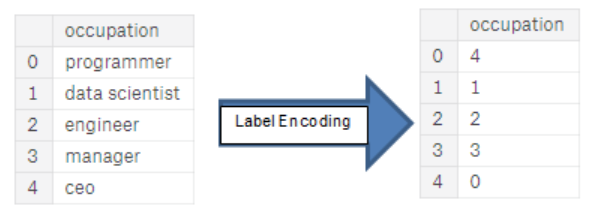
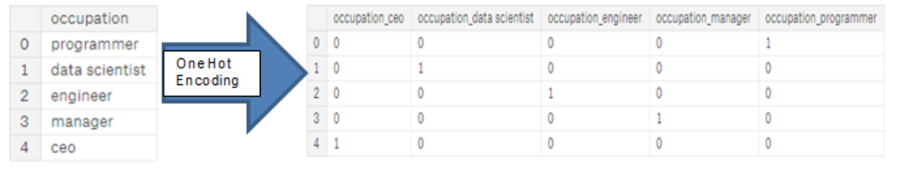
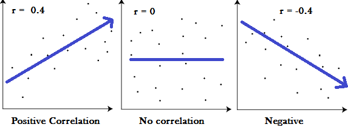
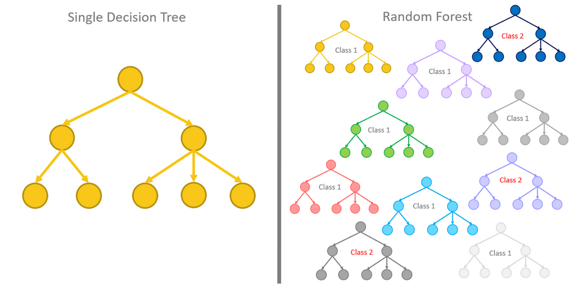

% Predicting Credit Defaults with Amazon SageMaker
% Class University
% 2020
---

# Question of the Day

- What are some advantages and disadvantages for using a cloud service to train machine learning models?

---

# Exploratory Data Analysis

#### Ideas to try:
- Identify categorical variables and encode them
- Look for missing data values
- Decide whether to estimate missing values or drop the column altogether
- Look at correlation of attribute columns with the target column

---

# Categorical Variable Encoding

To convert categorical variables to numeric ones an encoding method is used.

Two popular encoding methods are:

- Label Encoding
- One-hot Encoding
  
---

# Label Encoding

::: notes

Label encoding is the process of assigning each distinct categorical value with an integer representation. If we encode multiple times we have no guarantee of the encoding order. 

:::

---

# One-hot Encoding

::: notes

One-hot encoding creates a vector the length of the number of distinct values. Each value is then an identity vector.

It is advisable to use one-hot encoding for categorical variables with more than 2 distinct values.

:::

---

# Pearson's correlation coefficient

::: notes

A value r represents the degree by which two variables correlate. If r is positive it indicates that if one variable moves positively. If r is negative the variables have an inverse relationship. One variable moves positively and the other negatively. If r is 0 there is no correlation. We can use Pearson's coefficient to determine if two variables could have a correlation. 

In the mtcars dataset we shall look at how the columns are related to the target.

:::
---

# Imputation

- Missing values can be replaced for an attribute that is missing data.
- Has a particular value just been deleted?
- The mean can be used for a substitution value
- A value from a regression could be used
- There are many imputation techniques

---

# Random Forest

::: notes

A random forest is a collection of decision trees that are each trained on a subset of the training data.

:::

---